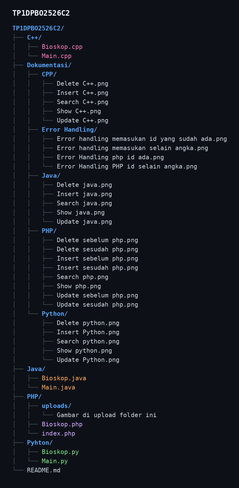

# JANJI
Saya Renaldy Heryana dengan NIM 2509867 mengerjakan Tugas Praktikum 1 dalam mata kuliah Desain dan Pemrograman Berorientasi Objek untuk keberkahanNya maka saya tidak melakukan kecurangan seperti yang telah dispesifikasikan. Aamiin.

# FITUR UTAMA
- Tambah Data: Menambah objek baru.
- Tampilkan Data: Menampilkan semua objek yang tersimpan.
- Update Data: Mengubah data objek berdasarkan identifier unik (seperti ID).
- Hapus Data: Menghapus objek berdasarkan identifier unik (ID).
- Cari Data: Mencari satu objek spesifik.

# ERROR HANDLING

- Jika diminta memasukan id dan jumlah studio, maka ketika memasukan selain integer atau angka
user akan diminta memasukan ulang.

- Memasukan id selain integer PHP

- Jika saat memasukan id, id tersebut sudah ada dalam arraylist
  

- Jika saat memasukan id, id tersebut sudah ada dalam arraylist
  

# Struktur Repo

  
  
# Output Java

-Insert/Menambah data

-Update/Mengedit data

-Show/Menampilkan data

-Delete/Menghapus data

-Search/Mencari data

# Output CPP

-Insert/Menambah data

-Update/Mengedit data

-Show/Menampilkan data

-Delete/Menghapus data

-Search/Mencari data

# Output Python

-Insert/Menambah data

-Update/Mengedit data

-Show/Menampilkan data

-Delete/Menghapus data

-Search/Mencari data

# Output PHP

-Insert/Menambah data 

-Update/Mengedit data

-Show/Menampilkan data

-Delete/Menghapus data

-Search/Mencari data

